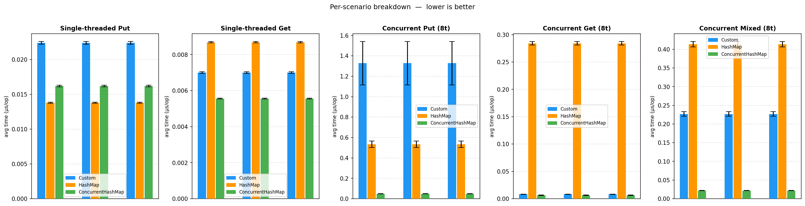
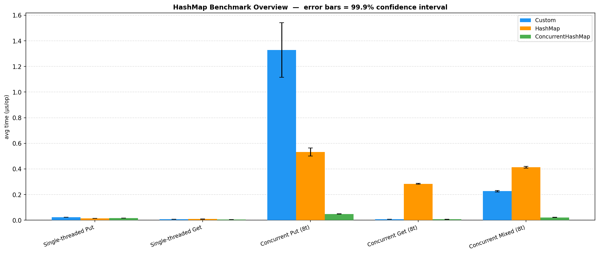
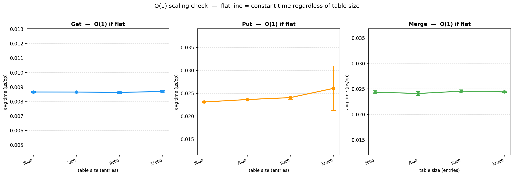

# Отчёт по лабораторной работе №4

Студент: Русинов Дмитрий

Содержание:
- [Задание](#задание)
- [Выполнение](#выполнение)
- [Архитектура](#архитектура)
- [Бенчмарки](#бенчмарки)
- [Тесты конкурентности JCStress](#тесты-конкурентности-jcstress)

## Задание

Требования к структуре:
- минимально необходимый набор операций: put(key: K, value: V), get(key: K) -> V, size() -> usize, clear(), merge(key: K, value: V, merger: Fn(V, V) -> V) -> V, итератор по парам ключ-значения
- (почти) никогда не блокирующие операции чтения
- однозначный наблюдаемый порядок между завершёнными операциями
За более формальной спецификацией см. Javadoc к ConcurrentHashMap (https://docs.oracle.com/en/java/javase/25/docs/api/java.base/java/util/concurrent/ConcurrentHashMap.html) в JDK.
При этом не требуется реализовывать конкретный интерфейс для таблицы из выбранного ЯП, это просто референс.

В работе также требуется:
- Написать бенчмарки (сравнивать перф уместно с не-thread-safe версией)
- Написать concurrency-тесты с использованием специализированного инструментария (например, если Java, jcstress)
- Нарисовать графики по числовым результатам
- Объяснить интересные результаты в отчётё

## Выполнение

Реализация выполнена на языке Java 21. Сборка через Gradle 8.

Структура проекта:
- [ClosedAddressingHashMap.java](app/src/main/java/org/example/ClosedAddressingHashMap.java) — основная реализация
- [HashMapFunctionalTest.java](app/src/test/java/org/example/HashMapFunctionalTest.java) — функциональные тесты (JUnit 5)
- [HashMapBenchmark.java](app/src/jmh/java/org/example/HashMapBenchmark.java) — JMH бенчмарки сравнения реализаций
- [ScalingBenchmark.java](app/src/jmh/java/org/example/ScalingBenchmark.java) — JMH бенчмарки проверки O(1)
- [NoLostUpdateTest.java](app/src/jcstress/java/org/example/NoLostUpdateTest.java), [MergeAtomicityTest.java](app/src/jcstress/java/org/example/MergeAtomicityTest.java), [PutGetVisibilityTest.java](app/src/jcstress/java/org/example/PutGetVisibilityTest.java) — JCStress тесты
- [scripts/plot_results.py](scripts/plot_results.py) — визуализация результатов JMH

## Архитектура

### Структура данных

Массив бакетов хранится как `AtomicReferenceArray` в volatile-поле, что делает переключение на новый массив при ресайзе атомарно видимым для всех читателей.

### Схема блокировок

Применяется двухуровневая схема блокировок.

Для записи (`put`, `merge`) захватываются два лока: разделяемый read-лок всей таблицы (через `ReentrantReadWriteLock`) и эксклюзивный страйп-лок для конкретного бакета (один из 16 `ReentrantLock`). Это позволяет нескольким потокам одновременно писать в разные бакеты, не мешая друг другу.

Для ресайза и `clear` захватывается write-лок всей таблицы, что блокирует все записи, но не чтения.

Для чтения (`get`) не захватывается никаких блокировок — используются исключительно volatile-чтения.

## Бенчмарки

Конфигурация: JMH, среднее время операции, 1 fork × 3 warmup + 8 measurement итераций. Доверительные интервалы 99.9% отображены как планки погрешностей на графиках.

Сравниваются три реализации:
- **Custom** — наша `ClosedAddressingHashMap`
- **HashMap** — `Collections.synchronizedMap(new HashMap<>())` — единственный глобальный монитор на все операции
- **ConcurrentHashMap** — стандартная JDK реализация

### Вывод по бенчмаркам сравнения

Реализация выигрывает у `synchronizedMap` в сценариях с преимущественно читающей нагрузкой, что и является её главной целью. Узкое место — накладные расходы `ReadWriteLock` при высококонкурентных записях, но проигрывает `ConcurrentHashMap`.

### Проверка O(1)

`ScalingBenchmark` запускает `get`, `put` и `merge` на нашей реализации при разных размерах таблицы (5 000 — 11 000 элементов). `get` и `merge` выбирают ключи из фиксированного пула 500 ключей, гарантированно присутствующих в таблице; `put` использует случайные ключи из всего диапазона.

## Тесты конкурентности JCStress

JCStress запускает акторов параллельно и проверяет отсутствие запрещённых исходов; запуск: `.\gradlew.bat jcstress`, отчёт: `app/build/reports/jcstress/`.

### NoLostUpdateTest

Проверяет, что параллельные вставки в разные бакеты не теряются.

### MergeAtomicityTest

Проверяет, что операция `merge` атомарна: два конкурирующих вызова не могут оба видеть результат первичной вставки, теряя одно из обновлений.

### PutGetVisibilityTest

Проверяет гарантию видимости: после завершения `put` значение должно быть доступно всем последующим `get`.
